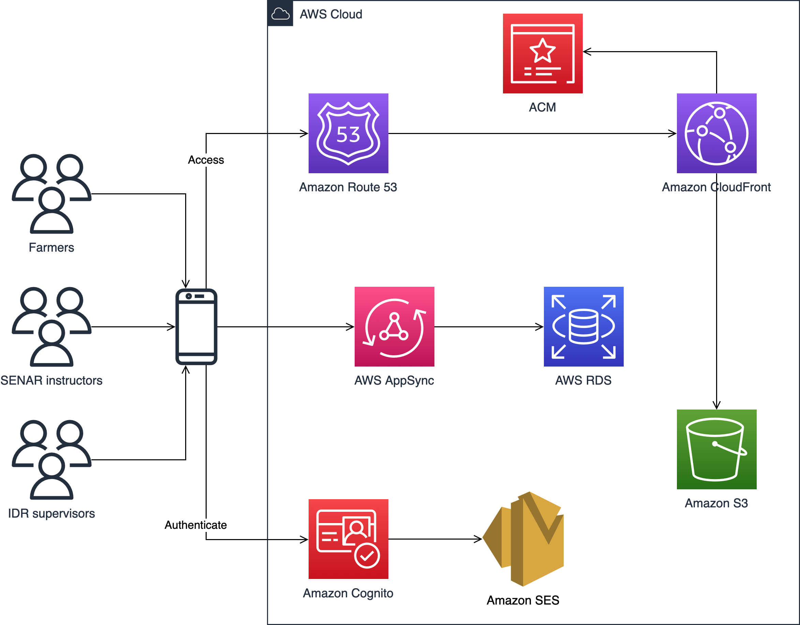

# manejo.mobile

manejo.mobile is a PWA, offline-first, cloud-native, serverless application to support Integrated Pest Management (IPM) by collecting and analysing pest occurrence data.

This project is part of a five-year cooperation between [Universidade Tecnológica Federal do Paraná](http://www.utfpr.edu.br) (UTFPR), [Serviço Nacional de Aprendizagem Rural](https://www.sistemafaep.org.br) (SENAR-PR), and [Instituto de Desenvolvimento Rural do Paraná](https://www.idrparana.pr.gov.br) (IDR).

## Project Overview

Farmers, SENAR instructors, and IDR supervisors uses manejo.mobile on their mobile devices. The application is hosted on Amazon S3, and accessed through Amazon Route 53. Amazon CloudFront distribute static content, supported by an ACM certificate for secure connection. Users authenticate using an Amazon Cognito user pool, supported by Amazon SES for email communication. Once installed, manejo.mobile uses Amplify framework for accessing a GraphQL API on AWS AppSync. The API provides operations for managing data on AWS RDS. CloudFormation templates describe the entire infrastructure.

## License

This project is NOT open-source or free to use. The code is kept in this repository for didact purposes only. Get in touch if you have any interest in using/building on the existing code.
